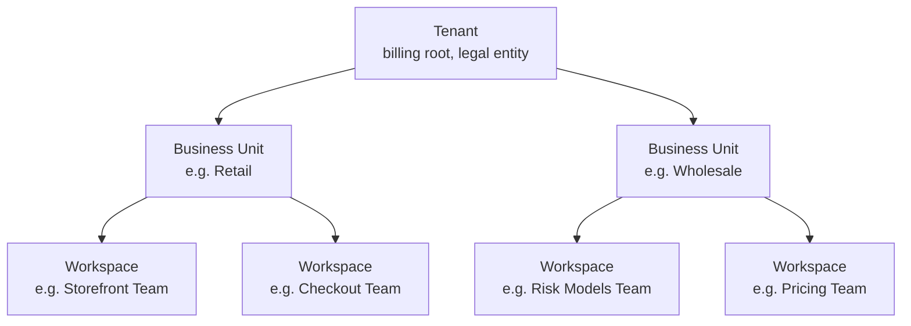

# Tenancy Model: Tenant → Business Unit → Workspace

This document is the canonical onboarding reference for how Forge Engineering Fabric organizes customers and isolates their workloads. It is written for non-technical Product, Business, and Finance stakeholders. Engineers building on or operating the platform should treat it as the authoritative description of the model, with implementation details in the linked specs and runbooks.

## At a Glance

Forge organizes the world into three nested levels:

1. **Tenant** — a customer organization, the legal/billing root.
2. **Business Unit (BU)** — a major division inside the Tenant (e.g., Retail, Wholesale, Risk).
3. **Workspace** — the unit a delivery team uses day-to-day to build and run one or more applications.

Every asset on the platform — apps, runtimes, OpenSpecs, audit events, costs — is owned by exactly one Workspace, which belongs to exactly one BU, which belongs to exactly one Tenant.

## Hierarchy Diagram

## GCP Analogy Mapping

For stakeholders familiar with Google Cloud, the levels map cleanly:

| Forge level | GCP analog | What it represents |
|---|---|---|
| Tenant | Organization / Billing Account root | The legal customer; the billing root; top of the IAM tree |
| Business Unit | Folder | A major division with shared governance, autonomy presets, and aggregated cost reporting |
| Workspace | Project | The day-to-day container a delivery team operates in: apps, runtimes, secrets, OpenSpecs, audit |

Other clouds map similarly: in AWS, Tenant ≈ Organization, BU ≈ Organizational Unit (OU), Workspace ≈ Account; in Azure, Tenant ≈ Tenant root group, BU ≈ Management Group, Workspace ≈ Subscription.

## Isolation Matrix

This matrix states **where** isolation is enforced (per-Tenant, per-BU, per-Workspace, or shared) and **how** it is enforced for each axis the platform cares about.

| Axis | Per-Tenant | Per-BU | Per-Workspace | How enforced |
|---|---|---|---|---|
| Identity (humans, groups) | Yes | Yes (groups) | Yes (groups) | Keycloak realms scoped per Tenant; OpenFGA tuples scoped per BU/Workspace |
| Authorization (relationships) | Yes | Yes | Yes | OpenFGA store partitioned per Tenant; tuples reference Workspace as the leaf object |
| Kubernetes cluster | Optional | Recommended | Optional | Configurable: shared cluster (namespaces) or dedicated cluster per BU/Workspace — see "Configuration Patterns" |
| Kubernetes namespace | — | — | Required | One namespace per Workspace; NetworkPolicies deny-by-default |
| LiteLLM budgets and rate limits | Yes | Yes | Yes | Budgets keyed on Tenant→BU→Workspace; rate limits enforced at gateway |
| Observability (metrics, logs, traces) | Yes | Yes | Yes | Tenancy labels on every signal; per-tenant Loki/Tempo/Mimir streams |
| Policy bundles | Yes | Yes | Yes | OPA bundles namespaced per Workspace, with BU and Tenant fall-through |
| Secret stores | Yes | Yes | Yes | Per-Workspace secret namespace; BU-scoped secrets visible to all Workspaces in the BU |
| Audit events | Yes | Yes | Yes | Every audit row tagged `tenant_id`, `bu_id`, `workspace_id`; partitioned by month |
| Cost showback | Yes | Yes | Yes | Tags propagated from cloud resources to FinOps showback views |
| RAG / knowledge | Yes | Optional | Yes | Milvus collections per Workspace; BU-shared collections opt-in |
| GitHub installation | Yes | Optional | Optional | One GitHub App installation per Tenant; repo-level access mapped to Workspace |
| Artifact Registry | Yes | Optional | Yes | Repository per Workspace by default; BU-shared repository opt-in |

"Optional" means the BU or Tenant admin chooses the level of isolation per the configuration pattern below.

## Configuration Patterns

A BU does not have to pick a single deployment model — Workspaces inside the same BU can be deployed differently. Most BUs choose one of three patterns:

### Pattern A: Shared cluster, namespace per Workspace

- One Kubernetes cluster serves the entire BU.
- Each Workspace gets its own namespace, ServiceAccount, NetworkPolicy and PodSecurity posture.
- LiteLLM, Postgres, Kafka and observability are shared; tenancy is enforced at the application and policy layer.

**Trade-offs**
- ✅ Lowest operational cost; fastest to onboard a new Workspace.
- ✅ Simple capacity planning at BU level.
- ⚠️ Noisy-neighbor risk under burst load; mitigated by `requests`/`limits`, HPAs, and PDBs.
- ❌ Weakest blast-radius isolation: a cluster-wide control plane incident affects every Workspace in the BU.

**Recommended when**: BU has many small Workspaces (<20 apps each), no regulatory cluster-isolation requirement, cost ceiling matters.

### Pattern B: Cluster per Workspace

- Each Workspace gets a dedicated cluster.
- Shared platform services (Keycloak, OpenFGA, audit, observability) remain at the BU or Tenant level.
- Workload-side dependencies (Postgres, Redis, Milvus) can be Workspace-local or shared.

**Trade-offs**
- ✅ Strongest blast-radius isolation; cluster-wide outages contained.
- ✅ Independent upgrade cadence per Workspace.
- ⚠️ Operational cost scales linearly with Workspace count.
- ❌ Cross-Workspace dependencies (shared Kafka, shared events) require explicit network paths.

**Recommended when**: a Workspace has regulatory or contractual cluster-isolation requirements (e.g., PCI scope), or runs production workloads with very high availability targets.

### Pattern C: Cluster per BU

- One cluster per BU; all Workspaces in the BU share it via namespaces.
- Variant of Pattern A scaled up to BU-size workloads.

**Trade-offs**
- ✅ BU-level financial and operational ownership clear.
- ✅ Cross-Workspace event flows easy (same Kafka, same broker).
- ⚠️ Cluster cost falls on the BU even if Workspaces are small.
- ❌ Cross-BU isolation depends on cluster boundaries; cluster compromise affects every Workspace in the BU.

**Recommended when**: a BU runs many Workspaces, wants a single financial owner per cluster, and accepts a single failure domain for the BU.

### Decision Criteria

A Platform Lead choosing a pattern for a new BU evaluates:

1. **BU size** — number of Workspaces and apps. Many small Workspaces favors A or C; few large Workspaces favors B.
2. **Workload sensitivity** — regulatory scope (PCI, HIPAA, SOX), data classification mix. Restricted data favors B.
3. **Regulatory requirements** — cluster-level or Workspace-level isolation mandates trump cost optimization.
4. **Cost ceiling** — A is cheapest, B is most expensive, C is intermediate. The FinOps showback view models all three.
5. **Operational maturity** — Pattern B requires more cluster-management capacity than A.

If the criteria conflict, escalate to Platform Architecture and Security review per the [governance procedures](../governance/).

## Cost Model

Forge defaults to **showback** — costs are attributed and visible per scope without cross-billing. Chargeback to BU or Workspace cost centers is an open question and tracked as future work in the `finops-chargeback` change.

### Cost visibility by role

| Role | Sees | Authorizes |
|---|---|---|
| Tenant Admin | All Tenant costs, broken down by BU and Workspace | Tenant-level budget caps; cost-allocation rule changes |
| BU Lead | Costs for their BU, broken down by Workspace | BU-level budget caps; chargeback opt-in (when enabled) |
| Workspace Owner | Costs for their Workspace; aggregate runtime, model, storage and network breakdown | Workspace-level rate limits and budget alerts |
| Finance | Read-only Tenant view with chargeback-ready exports | (No platform action; integrates with external ERP) |
| Security | Cost anomalies and budget breach events | Policy gates that pause workloads on anomaly detection |

Cost data is sourced from cloud billing exports plus the `finops` service (for LLM and platform-internal usage). Refresh cadence is **daily for showback**, **near-real-time for budget alerts**.

### Open question — chargeback

Chargeback to external finance systems (ERPs) is **out of scope** in this version of the model. The `finops-chargeback` follow-up change will add chargeback wiring once Tenants finalize their cost-allocation policies.

## Document Maintenance

| Field | Value |
|---|---|
| Owner | Platform Architecture |
| Reviewers | Security, FinOps, SDLC Leads |
| Review cadence | Semi-annual (and on every material change to the tenancy model) |
| Change approval | Material changes require Platform Architecture + Security review |

Material changes include: new isolation axes, new configuration patterns, changes to the cost-allocation default, changes to the cloud-analogy mapping, or changes that affect contractual sign-off documents.

## Related Documents

- [Platform Enablement Guide](../platform-enablement.md)
- [Platform Sizing Guidance](../platform-enablement.md#hardware--sizing)
- [Data Retention Policy](../governance/data-retention.md)
- [Phase Sign-Offs](../governance/)
